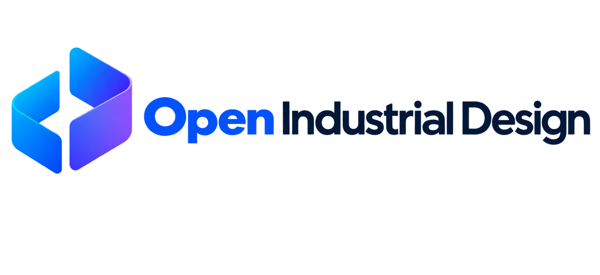
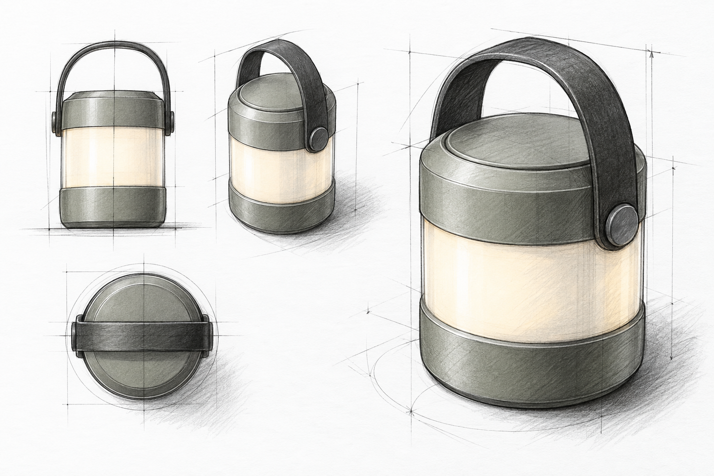

<p align="center">
  <picture>
    <source media="(prefers-color-scheme: dark)" srcset="./brand/logo/open-industrial-design-logo-dark.png">
    <source media="(prefers-color-scheme: light)" srcset="./brand/logo/open-industrial-design-logo-primary.png">
    
  </picture>
</p>

# Open Industrial Design v0.1.0-beta.1

<p align="center">
  <a href="https://github.com/truman-t3/open-industrial-design/releases"></a>
  <a href="https://github.com/truman-t3/open-industrial-design/actions/workflows/quality.yml"></a>
  <a href="./LICENSE"></a>
  <a href="./docs/release-status.md"></a>
</p>

<p align="center">从设计意图开始，在进入 CAD 前探索、比较并保留产品方案。<br>Start with design intent: explore, compare, and preserve product ideas before CAD.</p>

<p align="center">
  <a href="#中文介绍">简体中文</a> · <a href="#english-overview">English</a> · <a href="#快速开始">快速开始</a> / <a href="#quick-start">Quick start</a> · <a href="#示例流程">示例流程</a> / <a href="#example-workflow">Example</a> · <a href="https://github.com/truman-t3/open-industrial-design/releases">Releases</a>
</p>

## 中文介绍

> **Community Beta**：适合体验和反馈，重要项目请先导出备份。AI 使用自己的 API Key，费用由所选服务商收取；本项目不是 CAD，也不保证模型生成质量。

**Open Industrial Design** 是面向工业设计师的本地优先、支持自带 API Key（BYOK）的设计探索工作台。它将参考图、草图、概念方案、变体、CMF、设计血缘和轻量 3D 评审组织在同一个项目中，服务于进入 CAD 之前的探索与决策。

当前源码版本：**`0.1.0-beta.1`**。已发布版本以 [Releases](https://github.com/truman-t3/open-industrial-design/releases) 为准；本轮变更见 [版本说明](./docs/beta-0.1-release.md)。提供未签名 Windows x64 安装版和便携版公测包，下载以 Releases 为准；不提供托管服务；仓库目录名中的旧版本后缀不是应用版本。

### 已有能力

- **个人资料库与竞品研究**：用户自行添加图片、链接、笔记和集合；选择资料后手动调用 AI 辅助分析，保留当次证据快照。不自动抓取网站或冒充实时趋势数据库。
- **批量与图像编辑**：本地探索队列、个人提示词、选区蒙版、图案平面贴放和透明背景候选检查；生成质量及服务商能力仍需自行验证。
- **主画布**：导入图片、组织设计节点、拖动连线、撤销重做、分组和小地图；新草图和导入的 3D 模块自动避开已有卡片。
- **AI 设计探索**：手动触发生成，支持一张主图和最多四张参考图；候选可独立选择、比较、继续探索，再由设计师决定是否采纳。
- **设计工作流**：草图渲染、造型融合、风格、CMF、视角、场景及局部编辑任务；这些是操作流程，不代表所有模型都支持或保证生成效果。
- **草图与设计图谱**：保存 Excalidraw 可编辑草图、历史及静态预览；查看概念方案与变体的设计血缘，父设计 `parentDesignId` 是血缘依据。
- **3D 评审**：导入 GLB／GLTF，旋转、平移、缩放、切换标准视角，捕捉预览；不是 CAD 建模器。
- **本地项目与备份**：最近项目、多画板、自动保存、`Ctrl/Cmd + S` 立即保存、刷新恢复和 `.oidproj` 导入导出；包括格式校验、迁移及图片打包，API Key 不进入项目备份。

### 示例流程

以同一款便携灯具为例，从草图探索产品方向，再比较方案与使用场景。以下是内置示例素材，不是本次实时生成结果，也不是工作台界面截图。

| 草图输入                                               | 概念方案                                                    | 使用场景                                                  |
| ------------------------------------------------------ | ----------------------------------------------------------- | --------------------------------------------------------- |
|  |  |  |

示例来源：Open Industrial Design / truman-t3，AI 辅助制作；按 [CC BY 4.0 及署名说明](./DEMO_ASSETS_LICENSE.md) 使用。示例效果不构成对任意模型的能力保证。

1. **表达意图**：导入参考图或完成草图，连接生成任务的主图／参考图端口。
2. **探索方向**：选择草图渲染、CMF 或场景等任务，填写要求，确认服务商后手动生成。
3. **比较结果**：独立选择、移动候选，比较差异；可继续探索，不必立即采纳。
4. **保留决策**：采纳为方案、变体或参考图，查看设计血缘，并导出 `.oidproj` 备份。

### 快速开始

已核验环境：Node.js **24.14.0**、pnpm **11.19.0**。

```bash
git clone https://github.com/truman-t3/open-industrial-design.git
cd open-industrial-design
pnpm install --frozen-lockfile --ignore-scripts
pnpm dev
```

打开终端显示的地址，点击“打开示例项目”体验便携灯具探索流程。Windows PowerShell 若阻止 `pnpm` 脚本，请使用 `pnpm.cmd`。

需要 AI 时，在 Provider 设置中配置可信的 OpenAI-compatible 服务地址、模型及自己的 API Key，按实际能力选择文本、视觉或图像功能。只有手动运行才发起生成请求，费用由服务商收取。连接成功不代表该服务支持多图或蒙版编辑。详见[使用与备份指南](./docs/community-alpha-quickstart.md)（中文）。

### 数据与隐私

项目及图片保存在当前浏览器的 IndexedDB 中，无需登录或使用 Open Industrial Design 云服务。密钥与项目记录分开，可仅在会话中使用或记住在本地浏览器中，不进入 `.oidproj`。记住的密钥不是系统加密凭据库；使用 AI 时，所选输入和请求会发送给你配置的服务商，请只配置可信地址。

数据归属于当前浏览器和来源（协议、主机名、端口）。更换浏览器、域名或端口，包括从 `localhost` 改为 `127.0.0.1`，不会自动迁移数据。升级、更换浏览器或清理站点数据前，请导出 `.oidproj`；新版工程可能无法由旧版应用打开。

### 支持格式

| 用途     | 当前 Beta 支持                 |
| -------- | ------------------------------ |
| 参考素材 | 浏览器支持的图片文件           |
| 草图     | Excalidraw 场景数据及 PNG 预览 |
| 3D 评审  | `.glb`、`.gltf`                |
| 工程备份 | `.oidproj`                     |

### 核验与分发

发布前执行本地全量质量检查及对应提交的 [Windows CI](https://github.com/truman-t3/open-industrial-design/actions/workflows/desktop.yml)。检查包含版本一致性、GLB 测试素材、格式、lint、类型、自动测试及生产构建。隔离 Chromium 核验覆盖示例、候选独立操作、连线、资料分析、草图保存、GLB 导入与截图、工程导出／导入／刷新恢复，详见[工作流验收](./docs/reference-workflow-adaptation.md)。生成回归使用模拟请求，不代表所有真实服务商或模型通过验收。

GitHub CI 使用只读仓库权限、固定版本的 Actions，不配置服务商密钥，也不自动部署或发布。CI 通过只代表技术检查通过，不代替分发资料审核。

```bash
pnpm run release:check
pnpm run publication:check -- --public
pnpm run notices:check
```

最后一项是独立的成品分发资料检查。普通离线构建默认输出 `dist/licenses` 草稿；发布者可指定已公开的完整提交 SHA，匿名下载并逐文件核验对应源码后生成分发声明，步骤见 [发布状态](./docs/release-status.md)。当前 Release 仅提供源码，不附加编译成品。**源码发布不等于网页成品或安装包已通过分发验收。**

### 当前限制

- 不支持 CAD 编辑／导出、STEP／IGES／BREP、NURBS 编辑或 Blender／Rhino／KeyShot 集成；草图和 3D 仅用于创作与评审。
- 不包含专用本地 AI 超分辨率、AI 3D 生成、云同步、账号及多人协作。抠图使用兼容服务商生成候选并检查透明通道，不附带本地分割模型；图案平面贴放不等于 3D 表面映射。
- 连接成功不保证多图、图像编辑或蒙版支持；取消请求不保证服务商免收费用，生成的多视角也不是经过几何校验的 CAD 视图。
- 软件 WebGL 与隔离浏览器核验不等于所有真实 GPU、实体键鼠或原生中文输入法均已验收。编辑器按需加载，但大分块体积仍需优化。
- 资料库由用户自行补充，不自动抓取网站，也不是实时市场趋势数据库。桌面包属于未签名 Beta 公测版，不是稳定版。

### 参与社区与许可

项目自有 Community 源码采用 **MPL-2.0（不是 MIT）**，贡献采用 **DCO 1.1**；范围与排除项见[源码许可](./SOURCE_LICENSE.md)和 [LICENSE](./LICENSE)。品牌和示例图片不自动沿用代码许可证。

内置 8 张便携灯具示例图采用 **CC BY 4.0**，允许注明来源后修改、再分发和商用，详见[示例图片许可及署名格式](./DEMO_ASSETS_LICENSE.md)。品牌素材不适用此许可，遵循[品牌规则](./TRADEMARKS.md)。第三方材料见[运行时依赖清单](./THIRD_PARTY_NOTICES.md)及[发行许可复核](./docs/release-license-review.md)。

通过 [Issues](https://github.com/truman-t3/open-industrial-design/issues) 反馈 Bug、提交功能建议或询问使用问题；通过 Pull Request 贡献修复和文档。中文或英文均可，请先阅读 [贡献指南](./CONTRIBUTING.md)。

不要上传 API Key、私人工程或未脱敏日志；安全漏洞请先阅读 [安全反馈说明](./SECURITY.md)，不要在公开 Issue 中披露。当前不承诺固定回复时间，不启用自动回复或额外讨论区。

## English overview

> **Community Beta**: intended for evaluation and feedback. Export backups of important projects first. AI uses your own API key, with fees charged by your selected provider. This is not CAD and does not guarantee model output quality.

**Open Industrial Design** is a local-first, bring-your-own-key (BYOK) exploration workspace for industrial designers. It keeps references, sketches, concepts, variants, CMF, design lineage and lightweight 3D review in one project, supporting exploration and decisions before CAD.

Current source version: **`0.1.0-beta.1`**. See [Releases](https://github.com/truman-t3/open-industrial-design/releases) for published versions and the [release notes](./docs/beta-0.1-release.md) for this update. Unsigned Windows x64 installer and portable Beta packages are distributed through Releases. No hosted service is provided; an older version suffix in the checkout directory is not the application version.

### Capabilities

- **Personal library and competitor research**: add your own images, links, notes and collections; select evidence for manual AI-assisted analysis and preserve its snapshot. No automatic website crawling or purported live trends database.
- **Batch exploration and image editing**: local exploration queues, personal prompts, selection masks, flat pattern placement and transparent-background candidate checks. Provider support and generation quality still require verification.
- **Canvas**: import images, organize design nodes, drag connections, undo/redo, group items and navigate with a minimap. New sketches and imported 3D modules avoid existing cards.
- **AI exploration**: manually generate with one main image and up to four references. Independently select, compare and continue exploring candidates before deciding whether to adopt them.
- **Design workflows**: task briefs for sketch rendering, shape blending, style, CMF, views, scenes and local edits. These workflows do not guarantee that every model supports them or produces the intended result.
- **Sketch and design graph**: save editable Excalidraw scenes, history and static previews; inspect concept/variant lineage, with `parentDesignId` as its source of truth.
- **3D review**: import GLB/GLTF, orbit, pan, zoom, switch standard views and capture previews. This is not a CAD modeller.
- **Local projects and backups**: recent projects, multiple boards, autosave, `Ctrl/Cmd + S` save flush, refresh recovery and `.oidproj` export/import, including validation, migration and image packaging. API keys stay out of project backups.

### Example workflow

Explore the same portable lamp from sketch to concepts and usage scenes. The images below are bundled illustrative assets, not live outputs from this session or screenshots of the workspace.

| Sketch input                                                   | Concept                                                          | Usage scene                                                  |
| -------------------------------------------------------------- | ---------------------------------------------------------------- | ------------------------------------------------------------ |
|  |  |  |

Source: Open Industrial Design / truman-t3, AI-assisted. Use under [CC BY 4.0 with attribution](./DEMO_ASSETS_LICENSE.md). The examples do not guarantee the capabilities of any model.

1. **Express intent**: import references or complete a sketch, then connect the task's main-image/reference ports.
2. **Explore directions**: choose a sketch-rendering, CMF or scene task, describe your requirements, confirm the provider and manually generate.
3. **Compare results**: independently select and move candidates, compare differences and continue exploring without immediate adoption.
4. **Preserve decisions**: adopt a concept, variant or reference, inspect design lineage and export an `.oidproj` backup.

### Quick start

Verified environment: Node.js **24.14.0**, pnpm **11.19.0**.

```bash
git clone https://github.com/truman-t3/open-industrial-design.git
cd open-industrial-design
pnpm install --frozen-lockfile --ignore-scripts
pnpm dev
```

Open the address printed in the terminal and choose “Open demo project” to explore the portable lamp. If Windows PowerShell blocks the `pnpm` script, use `pnpm.cmd`.

For AI, configure a trusted OpenAI-compatible endpoint, model and your own API key in Provider settings, selecting text, vision or image features according to actual support. Generation runs only when triggered manually; your provider charges the fees. A successful connection does not prove multi-image or mask support. See the [usage and backup guide](./docs/community-alpha-quickstart.md) (Chinese).

### Data and privacy

Projects and images live in the current browser's IndexedDB. No login or Open Industrial Design cloud service is required. Keys are separate from project records, may be session-only or remembered locally, and are excluded from `.oidproj`. Remembered keys are not in an encrypted system credential vault. AI sends the selected inputs and request to your configured provider; use only trusted endpoints.

Data belongs to the current browser and origin (protocol, hostname and port). Changing browsers, domains or ports—including `localhost` to `127.0.0.1`—does not migrate data automatically. Export an `.oidproj` before upgrading, switching browsers or clearing site data. Older applications may not open newer project files.

### Supported formats

| Area           | Current Beta support                   |
| -------------- | -------------------------------------- |
| References     | Browser-supported image files          |
| Sketch         | Excalidraw scene data with PNG preview |
| 3D review      | `.glb`, `.gltf`                        |
| Project backup | `.oidproj`                             |

### Verification and distribution

Publication requires the full local quality gate and matching-commit [Windows CI](https://github.com/truman-t3/open-industrial-design/actions/workflows/desktop.yml). Checks cover version consistency, the GLB fixture, formatting, lint, types, automated tests and production build. Isolated Chromium checks cover the demo, independent candidates, connections, research analysis, sketch save, GLB import/capture and project export/import/refresh recovery. See [workflow acceptance](./docs/reference-workflow-adaptation.md). Generation regressions use mocked requests and do not certify all real providers or models.

GitHub CI uses read-only repository permissions and pinned Actions, with no provider keys, automatic deployment or publishing. Passing CI is a technical check, not a substitute for distribution review.

```bash
pnpm run release:check
pnpm run publication:check -- --public
pnpm run notices:check
```

The last command is a separate compiled-distribution notice check. Ordinary offline builds produce a `dist/licenses` draft. Publishers can specify a public full commit SHA and verify its anonymously downloaded source file by file before generating distribution notices; see [release status](./docs/release-status.md). Current Releases provide source only, with no compiled assets. **Source publication does not mean a compiled web app or installer has passed distribution acceptance.**

### Current limitations

- No CAD editing/export, STEP/IGES/BREP, NURBS editing or Blender/Rhino/KeyShot integration. Sketch and 3D tools are for creation and review only.
- No dedicated local AI super-resolution, AI 3D generation, cloud sync, accounts or collaboration. Cutout uses compatible-provider candidates with alpha-channel checks, not a bundled local segmentation model. Flat pattern placement is not 3D surface mapping.
- Connection success does not guarantee multi-image, image-editing or mask support. Cancellation does not guarantee waived provider fees, and generated views are not geometrically verified CAD views.
- Software WebGL and isolated-browser checks do not certify every real GPU, physical input device or native Chinese IME. Editors are lazy-loaded, but large chunks still need optimization.
- The research library is user-curated, not an automatic crawler or live market-trends database. Desktop packages are unsigned Beta builds, not stable releases.

### Community and licensing

Project-authored Community source uses **MPL-2.0 (not MIT)** and contributions use **DCO 1.1**; see the [source notice](./SOURCE_LICENSE.md) and [LICENSE](./LICENSE) for scope and exclusions. Brand and demo images do not automatically inherit the code license.

The eight bundled portable-lamp demo images use **CC BY 4.0**, allowing modification, redistribution and commercial use with attribution; see [demo licensing and attribution](./DEMO_ASSETS_LICENSE.md). Brand assets are excluded and follow the [brand rules](./TRADEMARKS.md). Third-party materials are covered by the [runtime dependency inventory](./THIRD_PARTY_NOTICES.md) and [release license review](./docs/release-license-review.md).

Use [Issues](https://github.com/truman-t3/open-industrial-design/issues) for bugs, feature requests and usage questions, and pull requests for code or documentation contributions. Chinese and English are welcome; read the [contribution guide](./CONTRIBUTING.md) first.

Do not upload API keys, private projects or unsanitized logs. Read the [security reporting policy](./SECURITY.md) before reporting vulnerabilities; do not disclose them in public Issues. No fixed response time is promised, and no automatic replies or additional discussion forum are enabled.
